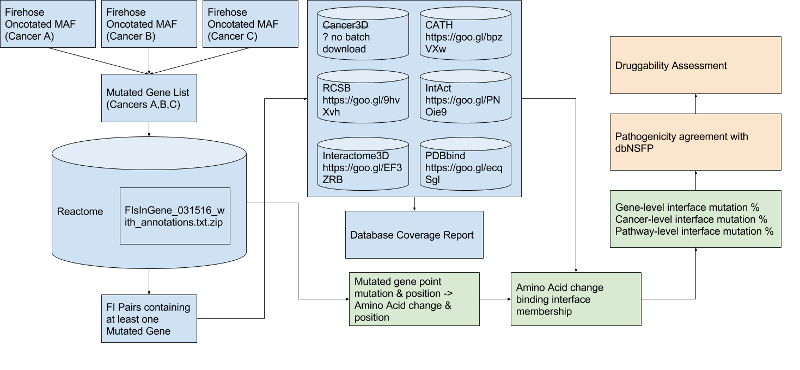

#Ogmios
A project to connect mutations with protein-protein interactions and small molecule binding in an effort to understand their effects on biochemical reactions and cell-signaling pathways.

##Workflow


##File I/O


##Getting Started
###Download MAF Files
Download and use the firehose_get utility from Broad GDAC
https://confluence.broadinstitute.org/display/GDAC/Download
```bash
$ wget http://gdac.broadinstitute.org/runs/code/firehose_get_latest.zip
$ unzip firehose_get_latest.zip
$ ./firehose_get -only mutation_packager_coverage oncotated data latest
```
###Download Reactome Files
```bash
$ wget http://reactomews.oicr.on.ca:8080/caBigR3WebApp2015/FIsInGene_031516_with_annotations.txt.zip
```
###Download Uniprot Files
```bash
$ wget ftp://ftp.uniprot.org/pub/databases/uniprot/current_release/knowledgebase/taxonomic_divisions/uniprot_trembl_human.dat.gz
```
###Ogmios/datasets
```bash
burkhart@nyx:~/Software/Ogmios/datasets$ ls
FIsInGene_031516_with_annotations.txt.zip
FIsInSelectedReactions_FDR_05_092516.txt
FIs_ProteinChemical.txt
gdac.broadinstitute.org_COAD.Mutation_Packager_Oncotated_Calls.Level_3.2016012800.0.0.tar.gz
gdac.broadinstitute.org_COAD.Mutation_Packager_Oncotated_Calls.Level_3.2016012800.0.0.tar.gz.md5
reactome_59_plus_i.sql.zip
uniprot_trembl_human.dat.gz
burkhart@nyx:~/Software/Ogmios/datasets$ md5sum ./*
d0a751a6a9279f4bbdae7be507d177c7  ./FIsInGene_031516_with_annotations.txt.zip
926e37cee5540f75825fadbb22d3a456  ./FIsInSelectedReactions_FDR_05_092516.txt
8867646869165df65356b1e0e170061c  ./FIs_ProteinChemical.txt
eb2d3871fdf2dafcd84128c6ecc07d34  ./gdac.broadinstitute.org_COAD.Mutation_Packager_Oncotated_Calls.Level_3.2016012800.0.0.tar.gz
64012d14699a9d0f4645905a059dc215  ./gdac.broadinstitute.org_COAD.Mutation_Packager_Oncotated_Calls.Level_3.2016012800.0.0.tar.gz.md5
b73e07c275c226a653a6966edc6ff469  ./reactome_59_plus_i.sql.zip
04a655311c70e87299b4f52a74a28bc7  ./uniprot_trembl_human.dat.gz
```
###MySql Server Installation & Configuration
```bash
$ sudo apt-get update
$ sudo apt-get install mysql-server
$ sudo mysql_secure_installation
$ sudo mysql_secure_installation
$ unzip Ogmios/datasets/reactome_59_plus_i.sql.zip
$ mysql -u <username> -p
mysql> CREATE DATABASE reactome_59_plus_i;
mysql> exit;
$ mysql -u <username> -p reactome_59_plus_i < Ogmios/datasets/reactome_59_plus_i.sql
$ /etc/init.d/mysql start
```
###Data Storage & Backup
zip & split a directory into 3gb files
```bash
$ zip -r -s 3g firehose_data.zip firehose_data/
```
calculate hashes to ensure fidelity
```bash
$ md5sum firehose_data.z*
```
unsplit the zip file using the "-s 0" switch
```bash
$ zip -s 0 firehose_data.zip --out unsplit_firehose_data.zip
```
unzip the unsplit file
```bash
$ unzip unsplit_firehose_data.zip
```
