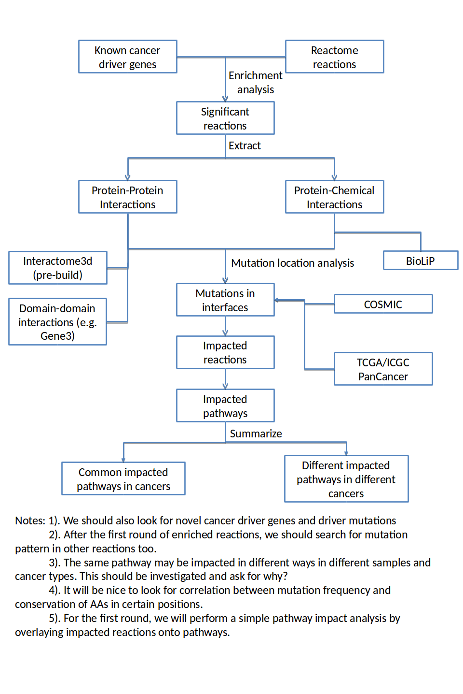

Ogmios
======
A project to connect mutations with protein-protein interactions and small molecule binding in an effort to understand their effects on biochemical reactions and cell-signaling pathways.

Workflow
--------


File I/O
--------


Getting Started
---------------
### Download MAF Files 
Download and use the *firehose_get utility* from Broad GDAC  
https://confluence.broadinstitute.org/display/GDAC/Download
```bash
$ wget http://gdac.broadinstitute.org/runs/code/firehose_get_latest.zip
$ unzip firehose_get_latest.zip
$ ./firehose_get -only mutation_packager_coverage oncotated data latest
$ ./firehose_get -tasks clinical stddata 2016_01_28
```
### Download Reactome File
```bash
$ wget http://reactomews.oicr.on.ca:8080/caBigR3WebApp2015/FIsInGene_031516_with_annotations.txt.zip
```
### Download Uniprot Files
```bash
$ wget ftp://ftp.uniprot.org/pub/databases/uniprot/current_release/knowledgebase/taxonomic_divisions/uniprot_{trembl,sprot}_human.dat.gz
```
### Download COSMIC File 
Download *CosmicMutantExport.tsv* via the COSMIC SFTP site    
https://cancer.sanger.ac.uk/cosmic/download

### Download Interactome3D Files
```bash
$ wget wget http://interactome3d.irbbarcelona.org/user_data/human/download/representative/{interactions_{01..20}.tgz,interactions.dat,proteins_{01..31}.tgz,proteins.dat}
```

### Ogmios/datasets Directory Structure
```bash
burkhart@nyx:~/Software/Ogmios$ tree -d ./datasets/
./datasets/
├── COSMIC
│   └── v80
├── interactome3d
│   └── 2016_06
│       └── prebuilt
│           └── representative
└── UniProt
    └── release_2016_06

8 directories
```
### MySql Server Installation & Configuration
```bash
$ sudo apt-get update
$ sudo apt-get install mysql-server
$ sudo mysql_secure_installation
$ sudo mysql_secure_installation
$ unzip Ogmios/datasets/reactome_59_plus_i.sql.zip
$ mysql -u <username> -p
mysql> CREATE DATABASE reactome_59_plus_i;
mysql> exit;
$ mysql -u <username> -p reactome_59_plus_i < Ogmios/datasets/reactome_59_plus_i.sql
$ /etc/init.d/mysql start
```
### Data Storage & Backup
zip & split a directory into 3gb files
```bash
$ zip -r -s 3g firehose_data.zip firehose_data/
```
calculate hashes to ensure fidelity
```bash
$ md5sum firehose_data.z*
```
unsplit the zip file using the "-s 0" switch
```bash
$ zip -s 0 firehose_data.zip --out unsplit_firehose_data.zip
```
unzip the unsplit file
```bash
$ unzip unsplit_firehose_data.zip
```
